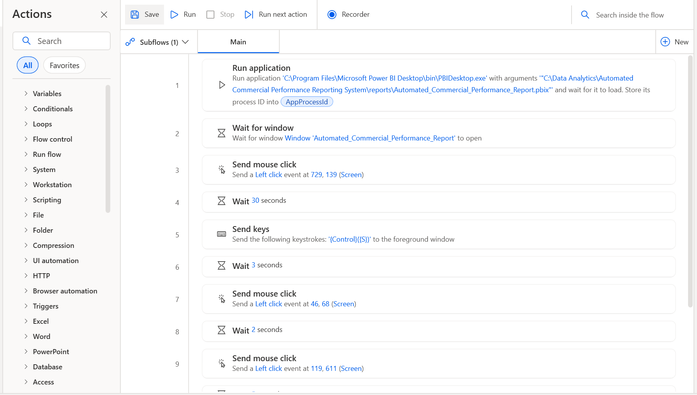
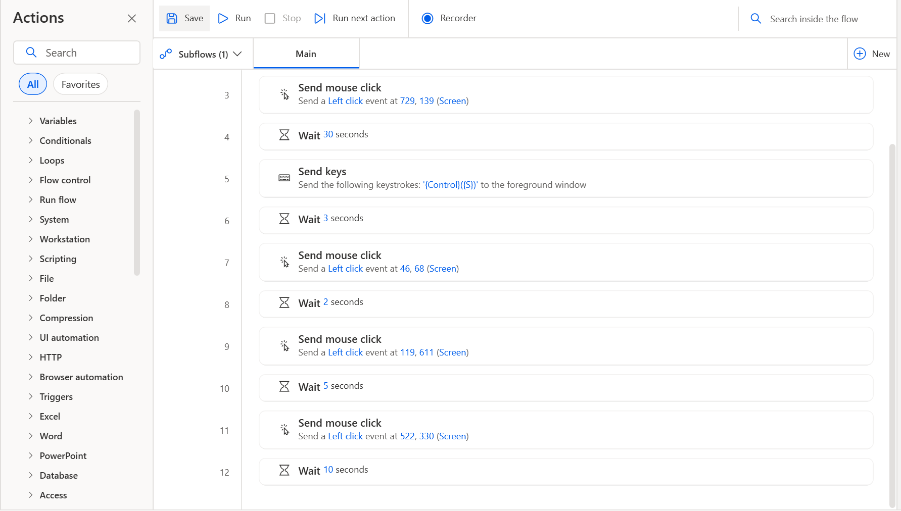

# Automated Commercial Performance Reporting System

**An end-to-end commercial analytics workflow for actual sales, CRM pipeline visibility, and management decision support.**

[Power BI Report](reports/Automated_Commercial_Performance_Report.pbix) · [Automated Excel Report](reports/adventureworks_executive_report.xlsx) · [Automation Runbook](docs/automation_runbook.md)


[](https://pytest.org/)


Built with Python, SQL Server, Excel, Power BI Desktop, Windows Task Scheduler, and Power Automate Desktop, this project connects data extraction and validation to reporting-ready datasets, management recommendations, and a repeatable local report-preparation workflow.

> **Project type:** Portfolio implementation demonstrating a practical data-to-decision workflow. It is not a production-hosted analytics service.

**Explore:** [Power BI dashboard](#power-bi-dashboard) · [Solution architecture](#solution-architecture) · [Run the pipeline](run_commercial_reporting.bat) · [Documentation](#documentation)

---

## At a glance

|                         |                                                                         |
| ----------------------- | ----------------------------------------------------------------------- |
| **Business focus**      | Commercial performance, profitability, CRM pipeline, management actions |
| **Actuals data**        | AdventureWorks SQL Server database                                      |
| **Pipeline data**       | Maven CRM opportunity dataset                                           |
| **Primary deliverable** | Power BI report                                                         |
| **Reporting outputs**   | Reporting-ready datasets and generated Excel workbook                   |
| **Automation**          | Python pipeline plus local PAD report-preparation workflow              |
| **Validation evidence** | Recorded pipeline run and scoped regression tests                       |

---

## Business Questions Addressed

| Business area | Reporting focus |
|---|---|
| Executive performance | Revenue, gross profit, gross margin, pipeline visibility |
| Commercial trends | Monthly performance and gross-profit movement |
| Product and category | Revenue and profitability patterns |
| Customer and seller | Revenue and gross-profit performance |
| CRM pipeline | Opportunities by stage, region, sales agent, product, and account |
| Management action | Findings and recommendations for margin, profitability, pipeline visibility, and prioritization |

---

## Power BI Report

**Primary deliverable:** [`Automated_Commercial_Performance_Report.pbix`](reports/Automated_Commercial_Performance_Report.pbix)

### 1. Executive Overview
Headline actual-performance and pipeline KPIs, monthly revenue and gross-profit trends, pipeline-stage metrics, and executive observations.


### 2. Actual Commercial Performance
Revenue and gross margin by category, product performance, customer revenue versus gross profit, and seller gross-profit performance.


### 3. Pipeline Performance
Opportunity volume and closed value by stage, regional activity, sales-agent pipeline activity, product pipeline, and account performance.


### 4. Management Recommendations
An action register with priority, area, finding, recommendation, and metric. Topics include gross margin, customer profitability, seller profitability, pipeline visibility, and pipeline prioritization.


---

## Solution Architecture

```text
AdventureWorks (actual sales)       Maven CRM (opportunities)
              |                                |
              v                                v
      SQL Server extraction             CSV extraction
              |                                |
              v                                v
       Transformation                 Standardization
              |                                |
              v                                v
          Validation                     Validation
              |                                |
              +---------------+----------------+
                              |
                              v
                 Reporting dataset preparation
                              |
              +---------------+----------------+
              |               |                |
              v               v                v
       Excel workbook      Power BI       Management
       (Python output)     dashboard      recommendations
                              |
                              v
                  Power Automate Desktop
                  refresh / save / PDF
                   export navigation
                              |
                              v
                    Human PDF review/save
```

The Python implementation is separated into AdventureWorks, Maven CRM, and reporting modules. PAD operates the local Power BI Desktop interface; this is not a Power BI Service workflow.

---

## Data Sources & Analytical Output

### 📊 AdventureWorks — actual commercial performance

AdventureWorks data is extracted from a locally configured SQL Server database. Processing supports revenue, cost, gross profit, gross margin, and related performance summaries.

Recorded development connection:

- Server: `ROKKA\SQLEXPRESS`
- Database: `AdventureWorks2022`
- Driver: ODBC Driver 18
- Authentication: Windows trusted connection

These are local development settings. Configure the connection for your own environment before running the project.

### 📊 Maven CRM — pipeline performance

Source files in `data/raw/maven_crm/`:

- `accounts.csv`
- `data_dictionary.csv`
- `products.csv`
- `sales_pipeline.csv`
- `sales_teams.csv`

The pipeline standardizes known product-name variation before validation and derives pipeline business-state and value metrics.

---

## Python Reporting Pipeline

**Entry point:** `src/run_commercial_reporting.py`

The main workflow extracts AdventureWorks and Maven CRM data, transforms and validates it, builds reporting datasets, generates observations and five management recommendations, exports CSV files, and logs execution status.

### 📁 Automatically generated Excel report

The Excel report is **generated automatically from the Python pipeline run output**; it is not manually assembled.

Output: `reports/adventureworks_executive_report.xlsx`

The reporting package includes workbook construction, formatting, chart creation, and export functionality. The Excel workbook is a supporting artifact; the primary interactive deliverable is the Power BI PBIX.

### 📁 Reporting datasets

AdventureWorks outputs in `data/reporting/`:

- `executive_kpis.csv`
- `monthly_performance.csv`
- `category_performance.csv`
- `product_performance.csv`
- `customer_performance.csv`
- `seller_performance.csv`
- `key_observations.csv`
- `management_recommendations.csv`

Maven CRM outputs in `data/reporting/maven_crm/`:

- `executive_pipeline_kpis.csv`
- `stage_performance.csv`
- `regional_performance.csv`
- `sales_agent_performance.csv`
- `product_performance.csv`
- `account_performance.csv`

### Recorded pipeline results

The latest recorded successful run was September 16, 2026: approximately 4.20 seconds, status `PASS`.

| AdventureWorks measure | Recorded result |
|---|---:|
| Revenue | approximately 109,846,381.40 |
| Cost | approximately 97,288,600.80 |
| Gross profit | approximately 12,557,780.60 |
| Sales lines | 121,317 |
| Historical-cost fallback rows | 64 |
| Unresolved cost rows | 0 |

Historical product-cost matching uses inclusive `StartDate` and `EndDate` boundaries. Recorded Maven CRM processing included 8,800 opportunities. A known product naming variation (`GTXPro` to `GTX Pro`) was standardized in the processing/validation path without editing the raw source file.

These are recorded run results, not guaranteed values for future executions.

---

## Desktop Report Automation

Microsoft Power Automate Desktop automates parts of the local Power BI Desktop workflow.

The documented flow contains 12 actions, including:

1. Launch Power BI Desktop and open the PBIX.
2. Wait for the report window.
3. Click the configured Refresh control.
4. Wait 30 seconds for refresh processing.
5. Save the PBIX using `Ctrl+S`.
6. Wait briefly for saving.
7. Navigate through the PDF export interface using configured screen-coordinate clicks and waits.

The flow completed a fresh-start test, reached the PDF export stage, and the PDF page-fit setting was reviewed and confirmed. A cyclic-reference issue encountered during development was resolved.

### Automation boundary

**This is not a fully unattended end-to-end reporting and distribution system.**

- The 30-second refresh delay is fixed; it does not prove every refresh has completed.
- Refresh and export navigation use captured screen coordinates.
- Display scaling, resolution, window position, or Power BI UI changes can invalidate coordinates.
- PDF review and saving remain manual.
- Automatic PDF distribution, publishing, and automatic report correction are not implemented.
- Reliable operation while logged out or with a locked Windows session has not been established.





See [Automation Runbook](docs/automation_runbook.md) and [Report Export documentation](docs/report_export.md).

---

## Scheduling and Execution

The Python pipeline is configured in Windows Task Scheduler for daily execution at 6:00 AM. A recorded scheduled-task test returned `0x0`, and the associated pipeline log showed `Status: PASS`.

The Python scheduled task is separate from the Power BI Desktop UI flow. Do not create a competing trigger that could start PAD before Python has finished exporting the CSVs. Start the desktop flow only after successful pipeline completion and confirmation that reporting data is current.

### 🚀 Run the Python pipeline

From the project root in Windows PowerShell:

```powershell
.\.venv\Scripts\Activate.ps1
python -m src.run_commercial_reporting
```

Additional entry points:

```powershell
python -m src.generate_adventureworks_report
python -m src.generate_management_recommendations
```

### 🚀 Run PAD manually

1. Confirm the Python pipeline completed successfully and CSVs are current.
2. Open Power Automate Desktop and select the report-preparation flow.
3. Ensure Power BI Desktop is not blocked by an unexpected dialog.
4. Run the flow.
5. Confirm refresh completion before relying on the report.
6. Review the PDF export and save it manually if correct.

---

## Validation and Testing

The pipeline includes source/row checks, structural and critical-field validation, key uniqueness and financial checks, and report-output checks. Failures are logged and raised rather than silently treated as valid zero activity.

The `test/` directory covers database connection, datasets, extraction, transformation, validation, Maven CRM processing/export, recommendation logic, reporting export, workbook generation, and management-recommendation integration.

**Latest recorded test result:** 8 tests passed in 15.93 seconds. The recorded run focused on management-recommendation integration and recommendation logic/output/export; it does not establish that every module is covered by those eight tests.

Run tests from the project root:

```powershell
python -m pytest test/ -v
```
---

## 🛠️ Technology Stack

| Technology | Role |
|---|---|
| Python / pandas | Pipeline execution, processing, validation, insights, report generation |
| SQL Server | AdventureWorks data source |
| SQLAlchemy / pyodbc | Database connectivity |
| CSV | Source and reporting-data interchange |
| Microsoft Excel | Automatically generated executive workbook |
| Power BI Desktop | Interactive commercial performance and pipeline report |
| Power Automate Desktop | Local desktop report-preparation workflow |
| Windows Task Scheduler | Scheduled Python execution |
| pytest | Automated tests |
| Git / GitHub | Version control and portfolio publication |

---

## 🏗️ Repository Structure

```text
Automated Commercial Performance Reporting System/
├── data/
│   ├── raw/
│   │   ├── adventureworks/
│   │   └── maven_crm/
│   └── reporting/
│       ├── category_performance.csv
│       ├── customer_performance.csv
│       ├── executive_kpis.csv
│       ├── key_observations.csv
│       ├── management_recommendations.csv
│       ├── monthly_performance.csv
│       ├── product_performance.csv
│       ├── seller_performance.csv
│       └── maven_crm/
├── docs/
│   ├── adventure_documentation.md
│   ├── automation_runbook.md
│   ├── generate_adventureworks_copy.py
│   ├── report_export.md
│   └── screenshots/
├── logs/
│   └── commercial_reporting.log
├── reports/
│   ├── Automated_Commercial_Performance_Report.pbix
│   └── adventureworks_executive_report.xlsx
├── src/
│   ├── adventureworks/
│   ├── maven_crm/
│   ├── reporting/
│   ├── generate_adventureworks_report.py
│   ├── generate_management_recommendations.py
│   └── run_commercial_reporting.py
└── test/
    ├── test_connection.py
    ├── test_datasets.py
    ├── test_extract.py
    ├── test_management_recommendations_integration.py
    ├── test_maven_datasets.py
    ├── test_maven_export.py
    ├── test_maven_extract.py
    ├── test_maven_transform.py
    ├── test_maven_validate.py
    ├── test_recommendations.py
    ├── test_reporting_export.py
    ├── test_transform.py
    ├── test_validate.py
    └── test_workbook.py
```

---

## Setup Requirements

- Windows
- Python and a configured virtual environment with project dependencies
- AdventureWorks database access and connection configuration
- Maven CRM source files under `data/raw/maven_crm/`
- Microsoft Excel to review the generated workbook
- Power BI Desktop to open and refresh the PBIX
- Power Automate Desktop to run the UI automation

Adapt the local SQL Server connection settings to your environment.

---

## Documentation

- [AdventureWorks documentation](docs/adventure_documentation.md)
- [Automation runbook](docs/automation_runbook.md)
- [Report export documentation](docs/report_export.md)

---

## Scope and Limitations

This is a portfolio implementation of commercial reporting and local desktop report preparation, not a hosted production analytics service.

- Local database and application dependencies.
- Fixed PAD refresh wait rather than programmatic refresh-completion detection.
- Coordinate-dependent desktop interactions.
- Manual PDF review and saving.
- No automatic PDF distribution or Power BI Service publishing.
- No automatic correction of source data, report logic, or dashboard layout.
- Unattended Power BI Desktop operation while logged out has not been validated.

The **14-step BI reporting framework** is a planning and governance guide—not a claim that every step is a separate software module or that the automation is fully productionized.

---

## License

Licensed under the MIT License. See [`LICENSE`](LICENSE).

## 🤝 Let's Connect

I’m interested in opportunities and conversations around **Business Intelligence, Data Analytics, Commercial Analytics, Revenue Analytics, and Operational Performance**.

📍 Ontario, Canada
🔗 

<p>
<a href="https://www.linkedin.com/in/abodunrin-oketade">

</a>

<a href="mailto:aoketade@gmail.com">

</a>

<a href="https://github.com/Richie-Rokka">

</a>

</p>

</div>

---

### Turning business data into actionable decisions.
