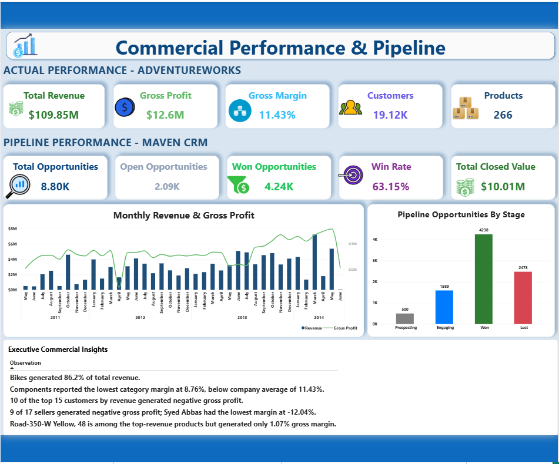
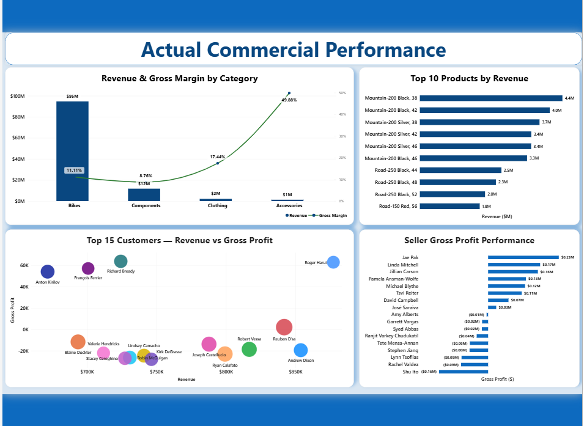
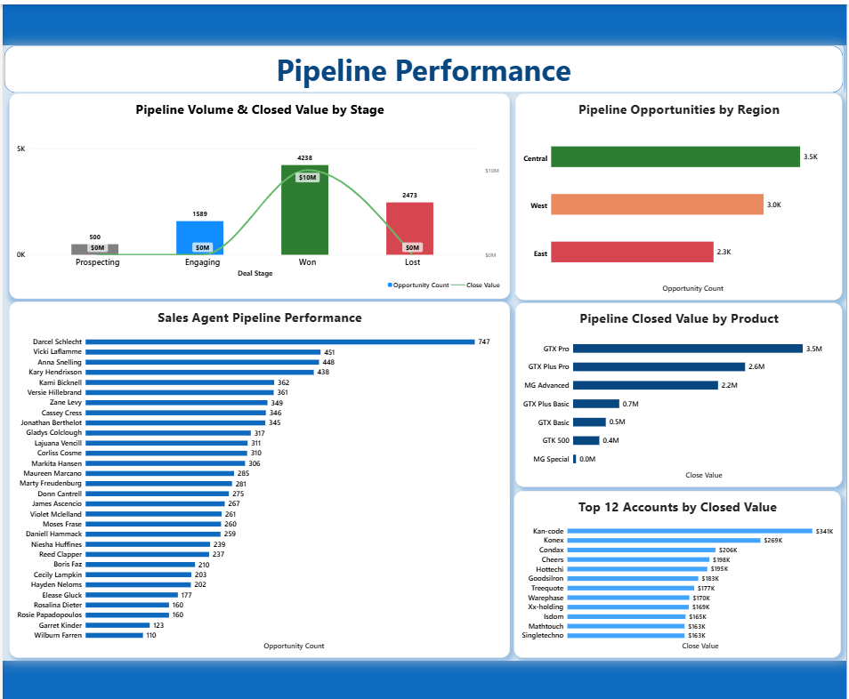
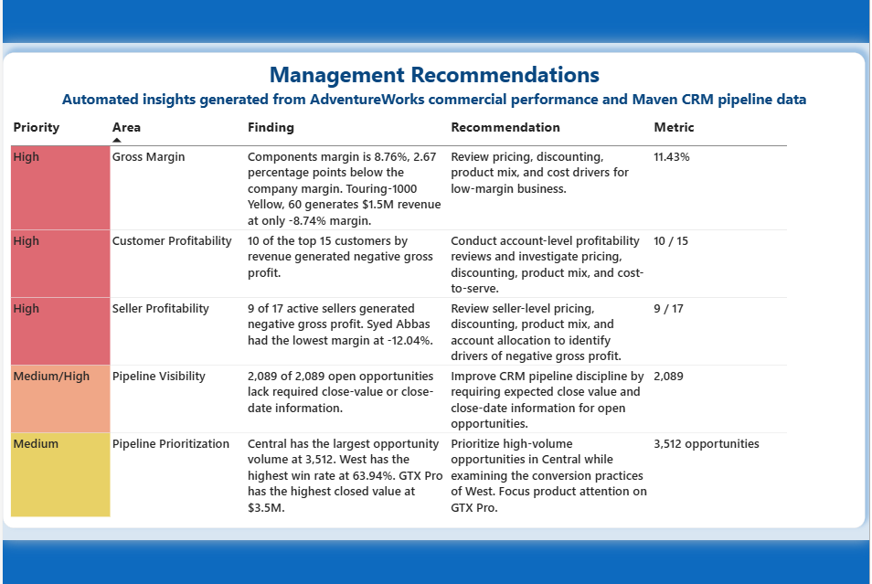

# Automated Commercial Performance Reporting System

An end-to-end commercial analytics and reporting project that combines **Python data pipelines**, **AdventureWorks sales data**, **Maven CRM pipeline data**, **Excel reporting**, **Power BI dashboards**, and **Power Automate Desktop (PAD)** to produce repeatable commercial performance reporting.

> **Project status:** The Python reporting pipeline, reporting outputs, Power BI report, and PAD desktop workflow are represented in the project structure. The PAD flow has completed a fresh-start end-to-end test. The cyclic-reference issue has been resolved. The current PAD refresh wait is 30 seconds. PDF review and saving remain manual by design.

---

## Contents

- [Project Overview and Business Objectives](#project-overview-and-business-objectives)
- [End-to-End Framework](#end-to-end-framework)
- [Data Sources](#data-sources)
- [Tools and Technologies](#tools-and-technologies)
- [Analytics and Reporting Outputs](#analytics-and-reporting-outputs)
- [Power BI Dashboard](#power-bi-dashboard)
- [Power Automate Desktop Workflow](#power-automate-desktop-workflow)
- [Validation and Testing](#validation-and-testing)
- [Repository Structure](#repository-structure)
- [Setup and Run Instructions](#setup-and-run-instructions)
- [Operating Considerations and Scope](#operating-considerations-and-scope)

## Project Overview and Business Objectives

Commercial reporting often requires data from different business domains to be extracted, standardized, validated, analyzed, and presented consistently. This project brings together actual sales performance and CRM pipeline activity in a repeatable reporting workflow.

### Business objectives

- Consolidate actual commercial performance and CRM pipeline reporting.
- Automate repeatable data extraction, transformation, validation, and report generation tasks.
- Produce reusable reporting datasets and management-oriented insights.
- Present commercial KPIs and trends through Excel and Power BI.
- Reduce repetitive desktop steps for refreshing, saving, and preparing the report for PDF export.
- Retain a human review and save decision before the PDF is retained or distributed.

## End-to-End Framework

The project is organized as a multi-stage data-to-decision workflow:

1. **Source data** — AdventureWorks commercial datasets and Maven CRM account, product, sales-team, and pipeline data.
2. **Data access and connection** — establish the AdventureWorks data connection through the dedicated connection module.
3. **Extraction** — load source datasets using the AdventureWorks and Maven CRM extraction modules.
4. **Transformation** — standardize and prepare source data for commercial analysis.
5. **Validation** — run dataset and transformation validation before downstream reporting.
6. **Reporting dataset preparation** — produce reporting-ready CSV outputs for actual performance and CRM pipeline analytics.
7. **Commercial KPI generation** — derive executive KPIs and supporting performance summaries.
8. **Insight and recommendation generation** — generate key observations and management recommendations from the analytical outputs.
9. **Excel report generation** — build formatted workbook and executive report outputs, including charts and presentation formatting.
10. **Power BI semantic/report layer** — use reporting datasets in the Power BI commercial performance report.
11. **Desktop report automation** — use PAD to open the PBIX, refresh, save, and navigate to PDF export.
12. **Human review and operational use** — review the exported PDF and decide whether to save it or make report corrections.

The repository contains dedicated modules for these stages. The exact execution sequence and transformations are implemented in the Python entry points and source modules.

## Data Sources

### AdventureWorks — actual commercial performance

The `data/raw/adventureworks/` directory holds the source data used for actual commercial performance analysis. The `src/adventureworks/` package contains modules for connection, dataset definitions, extraction, transformation, and validation.

### Maven CRM — pipeline performance

The `data/raw/maven_crm/` directory includes:

- `accounts.csv`
- `data_dictionary.csv`
- `products.csv`
- `sales_pipeline.csv`
- `sales_teams.csv`

The `src/maven_crm/` package contains dataset definitions, extraction, transformation, validation, and export functionality.

## Tools and Technologies

- **Python** — pipeline orchestration, data processing, validation, insights, and report generation.
- **pandas / Python data tooling** — tabular data preparation and transformation.
- **Microsoft Excel** — generated commercial and executive workbooks.
- **Microsoft Power BI Desktop** — interactive commercial performance and pipeline report.
- **Microsoft Power Automate Desktop** — desktop automation for report refresh, PBIX save, and PDF-export navigation.
- **CSV** — source and reporting-data interchange.
- **pytest / Python unittest-style tests** — automated checks under the `test/` directory.
- **Git / GitHub** — version control and portfolio presentation.

## Analytics and Reporting Outputs

### Reporting datasets

The `data/reporting/` directory contains actual commercial performance outputs:

- `category_performance.csv`
- `customer_performance.csv`
- `executive_kpis.csv`
- `key_observations.csv`
- `management_recommendations.csv`
- `monthly_performance.csv`
- `product_performance.csv`
- `seller_performance.csv`

The `data/reporting/maven_crm/` directory contains CRM pipeline reporting outputs:

- `account_performance.csv`
- `executive_pipeline_kpis.csv`
- `product_performance.csv`
- `regional_performance.csv`
- `sales_agent_performance.csv`
- `stage_performance.csv`

### Excel deliverables

The `reports/` directory includes:

- `adventureworks_commercial_performance_report.xlsx`
- `adventureworks_executive_report.xlsx`

The reporting package includes chart creation, formatting, recommendations, workbook construction, and export modules.

## Power BI Dashboard

The Power BI report is:

`reports/Automated_Commercial_Performance_Report.pbix`

The report presents four principal views:

### Executive Overview
Headline actual-performance and pipeline KPIs, monthly revenue and gross-profit trends, pipeline-stage metrics, and executive commercial observations.

### Actual Commercial Performance
Revenue and gross margin by category, top products by revenue, customer revenue versus gross profit, and seller gross-profit performance.

### Pipeline Performance
Opportunity volume and closed value by stage, opportunities by region, sales-agent pipeline activity, pipeline value by product, and leading accounts by closed value.

### Management Recommendations
Prioritized findings and suggested actions across gross margin, customer profitability, seller profitability, pipeline visibility, and pipeline prioritization.

### Dashboard screenshots

Place the screenshots in `docs/screenshots/` using these filenames (or update the paths below to match the actual filenames):









## Power Automate Desktop Workflow

The PAD flow automates routine report preparation. Its current flow contains **12 actions**:

1. **Run application** — launch Power BI Desktop and open `Automated_Commercial_Performance_Report.pbix`.
2. **Wait for window** — wait for the report window to open.
3. **Send mouse click** — click the configured Refresh control using captured screen coordinates.
4. **Wait 30 seconds** — allow refresh processing; this was reduced from 60 seconds to shorten runtime.
5. **Send keys (`Ctrl+S`)** — save the PBIX.
6. **Wait 3 seconds** — allow the save operation to settle.
7. **Send mouse click** — begin PDF-export navigation.
8. **Wait 2 seconds**.
9. **Send mouse click** — continue export navigation.
10. **Wait 5 seconds**.
11. **Send mouse click** — continue export navigation.
12. **Wait 10 seconds** — final action in the current flow.

The sequence uses screen-coordinate mouse clicks for the Refresh and export navigation actions. The desktop window position, display scaling, resolution, and Power BI interface should remain consistent with the captured coordinates.

**PDF handling is intentionally manual:** after the flow reaches the PDF export stage, the user reviews the result and chooses whether to save it, correct the report, or discard it. The flow does not automatically save or distribute the PDF.

## Validation and Testing

### Report automation validation

- A fresh-start PAD end-to-end test completed successfully.
- The report refresh action was confirmed.
- The flow reached the PDF export stage.
- PDF page fit was adjusted and confirmed correct.
- Action 12 is the final action in the current PAD flow.
- The cyclic-reference issue has been resolved.

### Python tests

The `test/` directory contains coverage for connection, datasets, extraction, transformation, validation, Maven CRM processing and export, recommendations, reporting export, workbook generation, and management-recommendation integration.

Run the relevant tests from the project root after activating the project environment. The exact test command may depend on the local environment and test runner configuration.

## Repository Structure

```text
Automated Commercial Performance Reporting System/
├── data/
│   ├── raw/
│   │   ├── adventureworks/
│   │   └── maven_crm/
│   │       ├── accounts.csv
│   │       ├── data_dictionary.csv
│   │       ├── products.csv
│   │       ├── sales_pipeline.csv
│   │       └── sales_teams.csv
│   └── reporting/
│       ├── category_performance.csv
│       ├── customer_performance.csv
│       ├── executive_kpis.csv
│       ├── key_observations.csv
│       ├── management_recommendations.csv
│       ├── monthly_performance.csv
│       ├── product_performance.csv
│       ├── seller_performance.csv
│       └── maven_crm/
│           ├── account_performance.csv
│           ├── executive_pipeline_kpis.csv
│           ├── product_performance.csv
│           ├── regional_performance.csv
│           ├── sales_agent_performance.csv
│           └── stage_performance.csv
├── docs/
│   ├── adventure_documentation.md
│   ├── automation_runbook.md
│   ├── generate_adventureworks_copy.py
│   └── report_export.md
├── logs/
│   └── commercial_reporting.log
├── reports/
│   ├── adventureworks_commercial_performance_report.xlsx
│   ├── adventureworks_executive_report.xlsx
│   └── Automated_Commercial_Performance_Report.pbix
├── src/
│   ├── generate_adventureworks_report.py
│   ├── generate_management_recommendations.py
│   ├── run_commercial_reporting.py
│   ├── adventureworks/
│   │   ├── connection.py
│   │   ├── datasets.py
│   │   ├── extract.py
│   │   ├── transform.py
│   │   └── validate.py
│   ├── maven_crm/
│   │   ├── datasets.py
│   │   ├── export.py
│   │   ├── extract.py
│   │   ├── transform.py
│   │   └── validate.py
│   └── reporting/
│       ├── charts.py
│       ├── export.py
│       ├── formatting.py
│       ├── recommendations.py
│       └── workbook.py
└── test/
    ├── test_connection.py
    ├── test_datasets.py
    ├── test_extract.py
    ├── test_management_recommendations_integration.py
    ├── test_maven_datasets.py
    ├── test_maven_export.py
    ├── test_maven_extract.py
    ├── test_maven_transform.py
    ├── test_maven_validate.py
    ├── test_recommendations.py
    ├── test_reporting_export.py
    ├── test_transform.py
    ├── test_validate.py
    └── test_workbook.py
```

## Setup and Run Instructions

### Prerequisites

- Windows environment.
- Python installed and a project virtual environment configured.
- Required Python packages installed in that environment.
- Source data available under `data/raw/`.
- For AdventureWorks extraction, the configured database connection and access must be available.
- Microsoft Excel (for reviewing generated workbooks).
- Microsoft Power BI Desktop (for opening and refreshing the PBIX).
- Power Automate Desktop (for running the desktop automation).

### Run the Python reporting workflow

From the project root, activate the virtual environment, then run the project entry point:

```powershell
.\.venv\Scripts\Activate.ps1
python -m src.run_commercial_reporting
```

The repository also includes these dedicated scripts:

```powershell
python -m src.generate_adventureworks_report
python -m src.generate_management_recommendations
```

Use the relevant entry point for the report you intend to regenerate. If your local setup uses a different invocation or configuration, follow the project’s current environment and connection settings.

### Run tests

From the project root with the virtual environment activated:

```powershell
python -m unittest discover -s test -v
```

If the project is configured to use pytest, run:

```powershell
python -m pytest test/
```

### Run the Power BI / PAD reporting workflow

1. Confirm source data and reporting CSVs are current.
2. Open Power Automate Desktop and select the completed flow.
3. Ensure Power BI Desktop is not left in an unexpected dialog or window state.
4. Run the flow.
5. Allow it to open the PBIX, trigger refresh, wait 30 seconds, save the PBIX, and navigate through PDF export.
6. Review the PDF and save it manually if it is correct.
7. If corrections are needed, update the report and repeat the workflow as appropriate.

## Operating Considerations and Scope

- The current refresh wait is **30 seconds**. It is a fixed delay, not a guarantee that every refresh will finish within that time. Confirm refresh completion before relying on the report output.
- The cyclic-reference issue is **resolved**.
- Screen-coordinate mouse actions may need to be re-captured if display scaling, resolution, window position, or Power BI UI changes.
- The automation does not independently verify the correctness of every business metric or source record.
- PDF review and saving remain manual.
- Automatic PDF saving, automatic publishing/distribution, and automatic correction of data, report logic, or dashboard layout are outside the current scope.

---

## Project Deliverables at a Glance

- Python data extraction, transformation, and validation modules for AdventureWorks and Maven CRM.
- Reporting-ready CSV datasets for actual commercial performance and CRM pipeline analytics.
- Excel commercial and executive reports.
- Power BI commercial performance and pipeline dashboard.
- Management observations and recommendations.
- PAD workflow for refreshing and preparing the report for PDF review.
- Documentation, execution log, and automated test suite.
